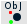
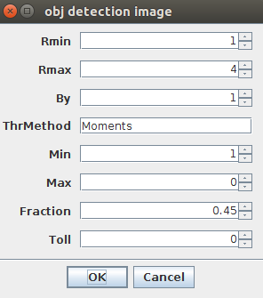
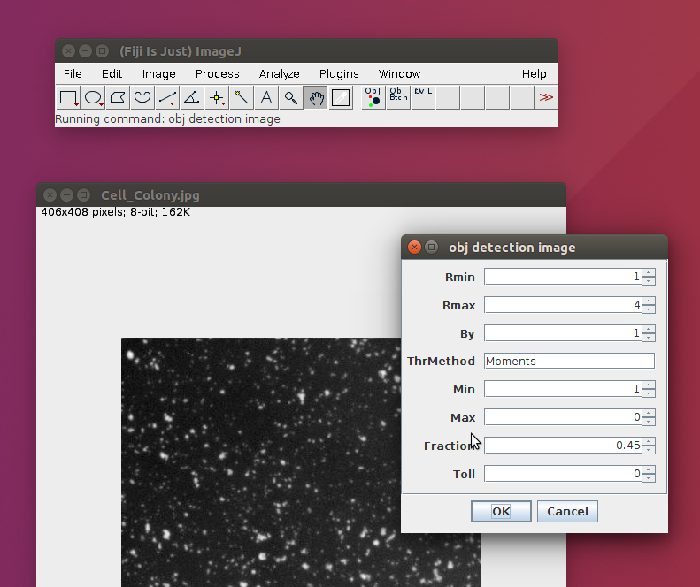
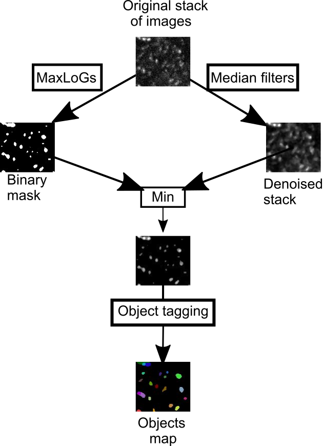
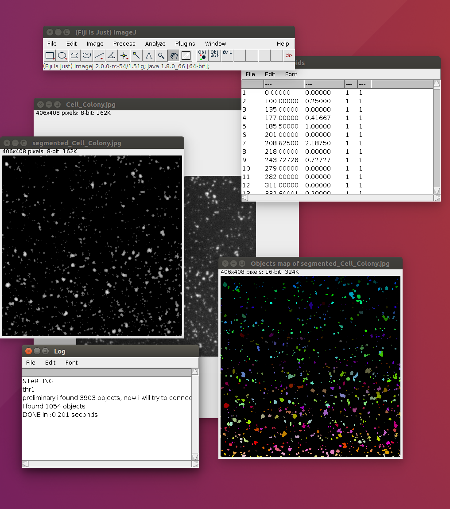

# obj_detection_toolest

### author: Gherardo Varando (gherardo.varando@gmail.com)

The use of **obj detection toolset** require a basic knowledge of ImageJ/Fiji. Please refer to its online documentation for further explanations (<http://imagej.net/Introduction>).

Dependencies and Requirements
-----------------------------

**obj detection toolset** is an extension for ImageJ, so obviously a version of ImageJ is required. It is recommend to install FIJI [2], which, citing its website, is a “batteries-included” distribution of ImageJ, bundling a lot of plugins which facilitate scientific image analysis. Moreover, **obj detection toolset** require two plugins that are not available through the ImageJ updater and have to be manually installed. That is to simply drag-and-drop the .jar files in the plugin directory of the ImageJ installation[3]. Both plugins, ObjCounter and MaxLoGs filter, are available through github:

-   ObjCounter <http://gherardovarando.github.io/ObjCounter/>.

-   MaxLoGs filter <https://gherardovarando.github.io/MaxLoGs/>.

The toolset and all the dependencies are tested with ImageJ 1.51g and Java 1.8 but they should be compatibles also with older versions of ImageJ running on Java 1.6.

Installation
------------

**obj detection toolset** is distributed as an imageJ custom toolset, that is a set of macros accessible via buttons in the tool bar [4]. To download the toolset files clone or download the entire repository:

To install the toolset copy the `obj_detection_toolest.ijm` file in the [ImageJ/macros/toolsets/](ImageJ/macros/toolsets/) directory and the folder `obj_detection` in the plugin directory. After restarting ImageJ the toolset can be made visible with the `More Tools Menu` (usually on the right of the ImageJ interface). The toolset actions are also available through the **Plugins –&gt; obj detection** menu.

First run
---------

After the installation open ImageJ/FIJI and click the `More Tools Menu`  and select `obj detection toolset`. Now you can access the toolset buttons in the ImageJ tool bar .

You can now open an image or a stack and count objects. If you have FIJI installed you can open the `blob` sample image in **File –&gt; Open Samples**. Then click in the first button of the toolset  for detection and counting of the objects in the image. You can try (see Fig \[fig:parameter\]) different choices for the parameters of the algorithm (e.g. **Rmin=1, Rmax=4, By=1, ThrMethod=Moments, Min=0 ,Max=0, Toll=0** and if you are using a stack **Fraction=0.45**).

While the algorithm is running the various operations will be shown in the ImageJ status bar, and when the algorithm is tagging and counting the objects a text window with the results will appear with the output of the ongoing operations. When the algorithm finish all the operations the outputs will appear. See Section \[sec:basic\] for an extensive guide to the toolset capabilities.

Configuration
=============

As explained in the ObjCounter plugin help page [5] it is better to change some Java configuration parameter to avoid thread stack overflow due to recursive calls. Java options are defined in the `ImageJ.cfg` file in the main directory of your ImageJ installation (see ImageJ help [6] on example of Java configurations for ImageJ ). The thread stack size can be changed with the option \(-XssSIZE\) where \(SIZE\) is the desired size of the thread stack. Refer to Oracle documentation for a complete explanation of the Java options[7] [8].

Basic use
=========

In this section we explain the basic usage of the toolset.

Object detection
----------------

The object detection work-flow can be accessed with the relative button  once the **obj detection toolset** is active or with the **Plugins –&gt; obj detection –&gt; obj detection image** menu entry. The user is asked for the following set of parameters (Fig. \[fig:parameter\] and Fig. \[fig:guiDetection\_1\]):

-   **Rmin** (Integer) approximately the radius (px) of the smallest object to detect

-   **Rmax** (Integer) approximately the radius (px) of the biggest object to detect

-   **By** (Integer) parameter used to set the granularity of the search.

-   **ThrMethod** (String) name of the threshold method used (like `Intermodes, IsoData, Moments`,…all the method available in ImageJ).

-   **Min** (Integer) minimum object volume (px).

-   **Max** (Integer) maximum object volume (px).

-   **Fraction** (Decimal) parameter to control the amount of connections among different slices.

-   **Toll** (Integer) tolerance for object tag propagation.

An image is needed to be able to run the algorithm, otherwise a warning message is shown. The image is considered to represent bright object on a dark background, that is objects have in general higher pixels values than background.

The work-flow follows these steps (a schematic is shown in Fig. \[fig:schema\]):

1.  MaxLoGs filter of the original image with parameters **Rmin,Rmax,By**.

2.  Segmentation of the MaxLoGs filter with an automatic threshold method (**ThrMethod**) in foreground and background pixels.

3.  Denoising of the original image with a two-scale median filter.

4.  Retaining of the foreground pixels.

5.  Object tagging with ObjCounter plugin using parameter **Min, Max, Fraction, Toll**.

When the algorithm finishes the operations the results are shown (Fig. \[fig:guiDetection\_2\]). In particular four more windows will open:

-   **Objects\_title** shows the detected objects. Every object is marked with a number on all its pixels[9] and visually by different colors.

-   **segmented\_title** is the results of the segmentation procedure, that is all the detected background is set to 0.

-   **Centroids** shows a table with the coordinates of the centroids.

-   **Log** shows the total number of objects counted and eventually the results of the validations.

Validation with overlay
-----------------------

If in the image an overlay[10] is present (See Fig. \[fig:overlay\]) the ObjCounter algorithm will try to validate the object detections comparing it with the overlay. The overlay should be composed by points indicating approximately the center of the objects, thus one point for every object should be present[11]. If a polygon or square selection is present in the overlay the validation will be restricted to the selected region. The result of the validation is shown in the `log` text window and it reports the number of points of the overlay, the number of objects detected by the algorithm, the `precision`, `recall` and `F1 measure`[12].

Batch processing
----------------

The toolset offers the possibilities of batch processing large number of images with the **Plugins –&gt; obj detection –&gt; obj detection folder** command or with the respective button . All the images (and nothing more) have to be placed in a single folder, the user is then asked to select the parameters as in the **obj detection image** and additionally:

-   **Input directory** the directory were the original images are stored.

-   **Points output directory** the directory were the `csv` files with the centroids of the objects detected will be stored.

-   **Objects output directory** the directory were the `tiff` files with the segmented objects will be stored.

In the output folders the algorithm will write the output files as soon as they have been computed, working one image at a time. ImageJ will be unavailable for additional operations until the end of the process.

FAQ
===

-   **The algorithm does not work, the objects are wrongly detected, how can I fix it?** The parameters **Rmin** and **Rmax** are crucial so try to adjust them. Try to manually segment some objects and compute Feret diameters[13].

-   **The object are correctly detected in every slice but are over/under connected in the z dimension, what can I do?** Change the **Fraction** parameter, since it controls the “amount of connections between different slices”.

-   **My images are very noisy and the algorithm detect noise as objects, is there a solution?** The segmentation parts embeds a denoising element, you should probably consider to set larger values for the **Rmin** parameter, the values should be grater then the “size” of the noise. Another solution is to set larger values for the **Min** parameter, but you should not rely on the elimination of small objects to eliminate all the noise. The images are also filtered with a two-scale median filter after the segmentation but maybe you should consider to apply a custom filter beforehand.

-   **I have tried everything, but the algorithm does not detect the objects in my image correctly, what can I do now?** Probably our toolset is not suited for your case, we are assuming that the objects are bright blobs in a black background and that intensity is the only information available. If your objects are recognized by humans because of some prior informations the algorithm will not work, do not expect **obj detection toolset** to count people in an image of a crowd (but you can count stars in images of the sky[14]!! ).

-   **What if I want to partially change the algorithm to suit better my case?** It is very easy provided you know at least some ImageJ macro programming (<http://imagej.net/Introduction_into_Macro_Programming#Installing_macros> and <https://imagej.nih.gov/ij/developer/macro/functions.html>). The scripts defining the various actions can be found in the `obj_detection` folder. They are written in the ImageJ Macro language exactly with the purpose to be easily modifiable by an average user.

-   **Can I modify the source code of the toolset and the related plugins ObjCounter and MaxLoGs ?** Yes, sure all the source code is available on github[15] and it is released under GPL3. See the License section at the end of this document for details. In general ImageJ, FIJI and related ecosystem are open source, different licenses may apply. Please have a look at the ImageJ licensing page[16].

-   **In FIJI there is already a plugin called 3D Objects Counter, which are the differences?** 3D Objects Counter[17] by Fabrice P. Cordelieres was the starting point for coding our plugin ObjCounter[18]. ObjCounter has some computations improvement and it is more flexible[19] with respect to 3D Objects Counter but lacks some of the options of this last one. Please refer to ObjCounter page[20] for further comparisons.

-   **I found a bug/error/strange behavior** Please let us know[21]!! We hope to correct the bug and improve the toolset.

License
=======

This program is free software; you can redistribute it and/or modify it under the terms of the GNU General Public License as published by the Free Software Foundation; either version 3 of the License, or (at your option) any later version.

This program is distributed in the hope that it will be useful, but WITHOUT ANY WARRANTY; without even the implied warranty of MERCHANTABILITY or FITNESS FOR A PARTICULAR PURPOSE. See the GNU General Public License for more details.

You should have received a copy of the GNU General Public License along with this program. If not, see <http://www.gnu.org/licenses/>.

[1] originally developed for the study of 3D stacks of confocal microscopy

[2] <http://fiji.sc/>

[3] <http://imagej.net/Installing_3rd_party_plugins>

[4] <https://imagej.nih.gov/ij/docs/guide/146-20.html>

[5] <http://gherardovarando.github.io/ObjCounter/>

[6] <http://imagejdocu.tudor.lu/doku.php?id=faq:technical:how_do_i_increase_the_memory_in_imagej>

[7] windows: <http://docs.oracle.com/javase/8/docs/technotes/tools/windows/java.html>

[8] unix: http://docs.oracle.com/javase/8/docs/technotes/tools/unix/java.html

[9] It is possible to read the number in ImageJ status bar pointing the cursor over the object.

[10] <https://imagej.nih.gov/ij/docs/guide/146-11.html>

[11] Be careful in multi slice stack of images, in this case even if an object span through different slices there must be just one point in one of the slices

[12] <https://en.wikipedia.org/wiki/Precision_and_recall>

[13] You can use `freehand selections and then Analyze –> Measure`

[14] Tested with “The Starry Skies at Wildcat Mountain State Park, Wisconsin” available at [ https://www.goodfreephotos.com/united-states/wisconsin/wildcat-mountain-state-park/wisconsin-wildcat-mountain-state-park-the-starry-skies.jpg.php]( https://www.goodfreephotos.com/united-states/wisconsin/wildcat-mountain-state-park/wisconsin-wildcat-mountain-state-park-the-starry-skies.jpg.php)

[15]

[16] <http://imagej.net/Licensing>

[17] <http://imagej.net/3D_Objects_Counter>

[18] The present verison of ObjCounter retain little code from the 3D Object Counter source code

[19] ObjCounter is able to split objects based on the intensity variations, while 3D Objects Counter simply connects all the adjacent pixels and

[20] http://gherardovarando.github.io/ObjCounter/

[21] gherardo.varando@upm.es
